# Verification Code Recognition Model

# （验证码识别模型）

## 零、免责声明

本项目的免责声明请参阅 [DISCLAIMER.md](DISCLAIMER.md)。

## 一、简介

该项目是一个完整的**机器学习项目开发流程**或称为**深度学习项目开发流程**，包括以下六个部分：

1. 数据爬取
2. 数据标注
3. 数据预处理
4. 模型训练
5. 模型验证
6. 投入使用

**项目结构**

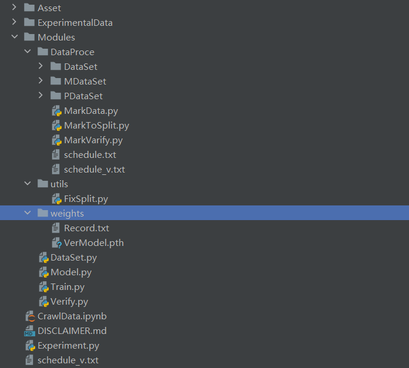

- `ExperimentalData` 目录：存放了一些图片，主要为 `Experment.py`文件提供数据。
- `Modules` 目录：该目录是数据处理的主要目录，包含了数据的标注、数据的预处理、模型训练、模型验证等部分；并且该目录是数据集存放的目录。
  - `DataProce` 目录：该目录存放了数据集、数据标注代码、数据切分代码、数据标签验证代码。
    - `DataSet` 目录：存放了爬取后的数据，未标注的数据集合。
    - `MDataSet` 目录：存放了经过标注后的数据集。
    - `PDataSet` 目录：存放了分割后的数据集。
    - `MarkData.py` 文件：该文件用于对初步爬取的文件进行标注。
    - `MarkVarify.py` 文件：该文件用于对标注好的文件进行检验。
    - `MarkToSplit.py` 文件：该文件用于对每一个具体的数据进行分割。
  - `utils` 目录：工具目录，该目录主要用于存放数据切割位置函数的文件。
    - `FixSplit.py` 文件：数据位置分割函数的代码文件。
  - `weights` 目录：该目录用于存放训练的权重和训练过程中的日志。
    - `Record.txt` 文件：存放了训练过程中的日志。
    - `VerModel.pth` 文件：模型训练后的权重文件。
  - `DataSet.py` 文件：编写数据读取的代码，编写了 `DataSet` 类。
  - `Model.py` 文件：模型主体代码。
  - `Train.py` 文件：模型训练代码。
  - `Verify.py` 文件：模型验证代码。
- `CrawlData.ipynb` 文件：爬取数据的主要文件，使用 `Jupyter Notebook` 的文件格式。
- `Experiment.py` 文件：项目案例代码，读取 `ExperimentalData ` 目录下的文件，并进行验证。

## 二、开发流程

### 1. 数据爬取

#### 1.1 分析

本项目使用的数据集是有关验证码的数据集，使用的**参考链接**为：https://login.cdpf.org.cn/uams/person.html?user_type=4


通过分析源码可以知道，该验证码数据是通过某种编码方式直接显示在 WEB 界面的，通过查询图片的编码方式，或直接复制部分该源码，询问 AI，让 AI直接对源码进行分析。

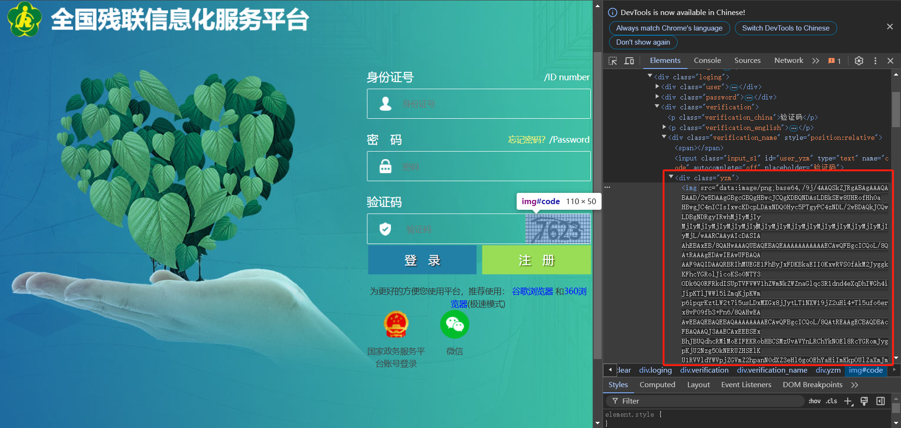

通过分析可以知道，该图片使用的是Base64的编码方式，因此搜索python对应的解码库，可以查到`base64`库可以进行解码，并且该库是 Python 标准库中的一个模块。页面分析完毕，接下来尽心划分任务，设定爬取 `2000` 张图片，然后以 `训练集: 测试集 = 0.75 : 0.25` 的方式划分数据集，并且选用 `selenium` 第三方库进行爬取数据。数据存储的文件按目录如下：


#### 1.2 代码实现

==CrawlData.ipynb==

##### 1) 导入第三方库

```python
# 导入 selenium 库，以及其他必要的库
from selenium import webdriver
from selenium.webdriver.common.by import By
from selenium.webdriver.chrome.options import Options
import time
import random
from tqdm import tqdm
import base64
from PIL import Image
import io
```

##### 2) 前置设定

```python
# 设置需要爬取图片的个数
epochs = int(input("需要爬取的总数量："))
# 测试集比例
testPorb = float(input('验证集比例（0.0 - 0.5）：'))
```

##### 3) 配置webdriver

```python
# 设置 Chrome 选项
chrome_options = Options()
chrome_options.add_argument("--headless")  # 无头模式
chrome_options.add_argument("--window-size=1920,1080")  # 设置窗口大小

# 初始化 Chrome WebDriver
driver = webdriver.Chrome(options=chrome_options)
```

##### 4) 初始化 Web 界面

```python
driver.get("https://login.cdpf.org.cn/uams/person.html?user_type=0")
time.sleep(3)
```

##### 5) 设置保存目录

```python
ROOT_DIR = "Modules/DataProce/DataSet"
TRAIN = "Train"
TEST = "Test"
TRAINDIR = ROOT_DIR + "/" + TRAIN
TESTDIR = ROOT_DIR + "/" + TEST
TRAINDIR, TESTDIR
```

##### 6) 定义处理Base64数据的函数

1. 对字符进行切割
2. 进行解码
3. 进行保存

```python
def dealBase64(idx, enc_base64):
    # 设定保存目录(取前epochs * testPorb部分为测试集，其他的为训练集)
    DIR = TRAINDIR if idx >= int(epochs * testPorb) else TESTDIR
    enc_base64 = enc_base64.split(',')[1]

    # 去掉换行符等无关字符
    enc_base64 = enc_base64.replace('\n', '').replace('%0A', '')
    # 解码 Base64 数据
    image_data = base64.b64decode(enc_base64)
    image = Image.open(io.BytesIO(image_data))
#     image.show()
    image.save(f'{DIR}/{idx}.png', quality=1)
```

##### 7) 进行爬取数据

```python
for epoch in tqdm(range(epochs)):
    pic_link = driver.find_element(By.XPATH, '//*[@id="code"]')
    src_value = pic_link.get_attribute('src')
    driver.refresh()
    dealBase64(epoch, src_value)
    time.sleep(random.uniform(1.5, 3))
```

##### 8) 结束标志

```python
"SUCCESS!!!"
```

### 2. 数据标注

#### 2.1 分析

爬取数据之后，每一个数据并没有标签，也就是一个杂乱的数据，此时需要对每一张图片进行标注，标注的方法有很多种，常见的有：

1. 利用每一张图片的名称作为其标签
2. 创建一个`txt`文本文件，记录每一张图片的标签。

这里使用了第一种方式进行标注数据。

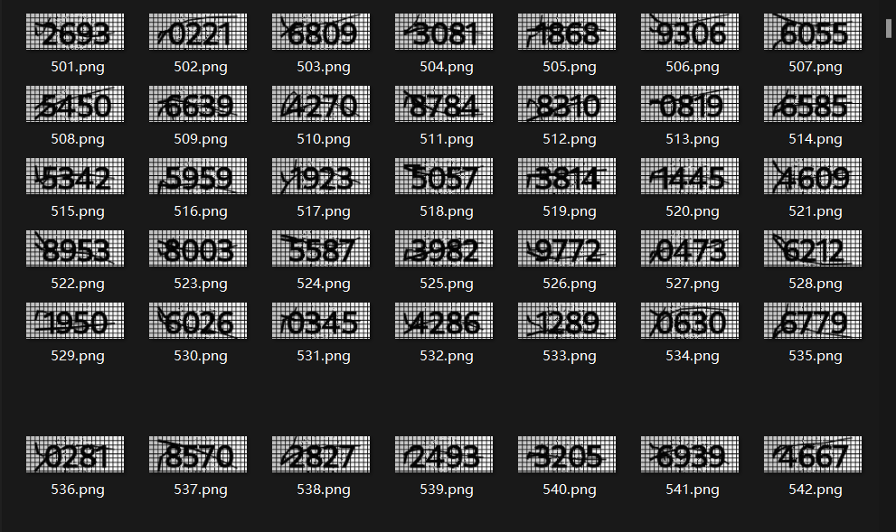

由于一共有 `2000` 张数据需要进行标注，这是一个相对庞大的数据量，为了更加方便的对每一个数据进行标注，可以自定义一个程序，来更快的对每一个数据打上标签。程序的功能如下：

1. 可以读取每一张图片数据，并且进行显示。

2. 显示完图片之后，关闭图片，可以输入你看到的数据。

3. 对输入的数据进行一次验证：如果输入的数据长度不等于4，需要重新进行输入；如果没有看清数据，输入`n`可以重新展示图片，然后再输入看到的数据。

4. 利用输入的数据，作为文件的名称，然后保存到其他文件夹中。

5. 能够记录当前的进度，下一次的时候可以接着上一次的进度进行标注。

   > 这里使用了一个`txt`文档进行保存进度，每标注10个都会做一次记录。然后如果要接着上一次的记录进行标注，可以设置一个`if - continue`语句来跳过前 `n`个已标注的数据。
   >
   > 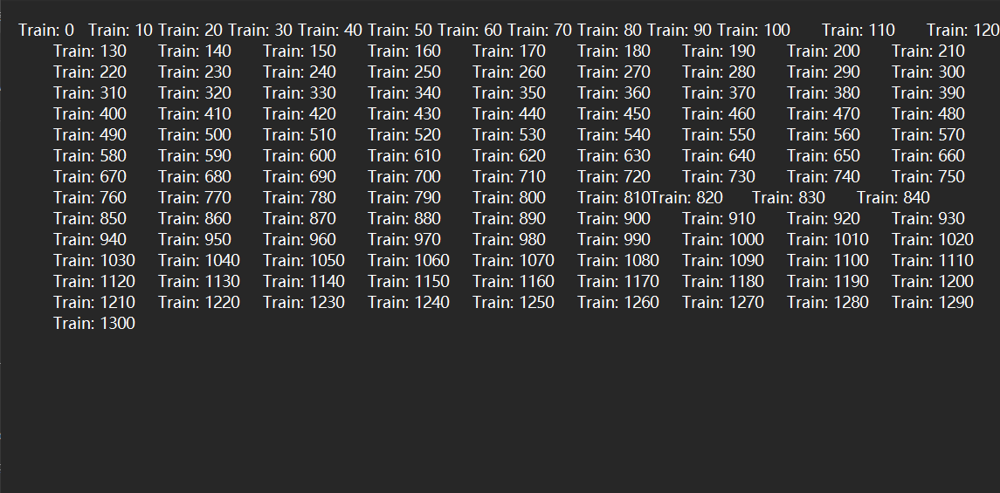

**效果如下**：

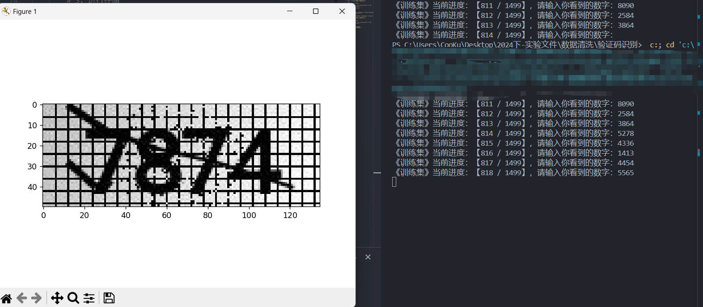

#### 2.2 代码实现

==MarkData.py==

```python
# 对所有图片进行标注
from PIL import Image
import matplotlib.pyplot as plt
import time
import os


# 进行存储
def re_save(name, image, n_dir):
    whole_dir = os.path.join(n_dir, name)
    image.save(whole_dir + '.png')


def show_pic(dir: str):
    image = Image.open(dir)
    plt.imshow(image)
    plt.show(block=True)
    # plt.pause(3)
    plt.close()
    return image


def main(oRootDir: str, nRootDir: str):
    TrainDir = os.path.join(oRootDir, 'Train')
    TestDir = os.path.join(oRootDir, 'Test')
    Train_files_ls = os.listdir(TrainDir)
    Test_files_ls = os.listdir(TestDir)
    # 将每一个数据都拼接为完整的相对路径
    Train_files = [os.path.join(TrainDir, nf) for nf in Train_files_ls]
    Test_files = [os.path.join(TestDir, tf) for tf in Test_files_ls]
    # print(Train_files)
    nTrain_files = os.path.join(nRootDir, "Train")
    nTest_files = os.path.join(nRootDir, "Test")
    if os.path.exists(nTrain_files) == False:
        os.makedirs(nTrain_files)
    if os.path.exists(nTest_files) == False:
        os.mkdir(nTest_files)

    # 设定新的路径

    # 进行训练集标注
    for idx, trainf in enumerate(Train_files):
        if idx <= SCHEDULE:
            continue
        # 1. 进行显示
        img = show_pic(trainf)
        # 2. 进行输入
        calib = str(input(f"《训练集》当前进度：【{idx} / {len(Train_files)}】，请输入你看到的数字："))
        while len(calib) != 4 or calib == 'n':
            if calib == 'n':
                _ = show_pic(trainf)
                calib = str(input(f"《训练集》当前进度：【{idx} / {len(Train_files)}】，请输入你看到的数字："))
            else:
                calib = str(input("ERROR, 请重新输入："))

        # 3. 进行存储
        re_save(calib, img, nTrain_files)
        if idx % 10 == 0:
            with open('schedule.txt', 'a+', encoding='utf-8') as file:
                file.write(f'Train: {idx}\t')
    # 进行测试集标注
    for idx, testf in enumerate(Test_files):

        # 1. 进行显示
        img = show_pic(testf)
        # 2. 进行输入
        calib = input(f"《测试集》当前进度：【{idx} / {len(Test_files)}】，请输入你看到的数字：")
        while len(calib) != 4 or calib == 'n':
            if calib == 'n':
                _ = show_pic(testf)
                calib = input(f"《测试集》当前进度：【{idx} / {len(Test_files)}】，请输入你看到的数字：")
            else:
                calib = str(input("ERROR, 请重新输入："))
        # 3. 进行存储
        re_save(calib, img, nTest_files)
        if idx % 10 == 0:
            with open('schedule.txt', 'a+', encoding='utf-8') as file:
                file.write(f'Test: {idx}\t')


if __name__ == "__main__":
    O_ROOTDIR = "DataSet"
    N_ROOTDIR = "MDataSet"
    SCHEDULE = 810		# 记录变量，其值为之前标注数据的个数。
    main(O_ROOTDIR, N_ROOTDIR)

```

### & 数据验证

由于是人工标注的数据，难免会出现错误，因此，可以再设定一个程序来对每一个数据进行验证。程序要求如下：

1. 能够在一个区域内同时显示 **图片数据** 和 **标签数据**。
2. 能够对错误图片的标签进行修改，这一步可以使用`os`库中的`rename`方法。

**效果如下**：

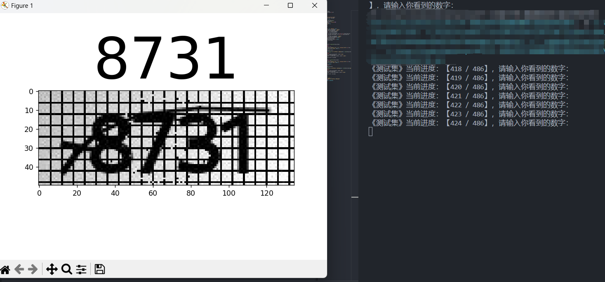

#### 代码实现

==MarkVarify.py==

```python
# 对所有图片进行标注
from PIL import Image
import matplotlib.pyplot as plt
import time
import os


# 对文件进行重命名
def rename_file(old_name,new_name):
    os.rename(old_name, new_name)

def show_pic(dir: str):
    _, name = os.path.split(dir)
    image = Image.open(dir)
    plt.title(name[:-4], fontsize=80)
    plt.imshow(image)
    plt.show(block=True)
    # plt.pause(3)
    plt.close
    return image


def main(oRootDir: str, nRootDir: str):
    TrainDir = os.path.join(oRootDir, 'Train')
    TestDir = os.path.join(oRootDir, 'Test')
    Train_files_ls = os.listdir(TrainDir)
    Test_files_ls = os.listdir(TestDir)
    # 将每一个数据都拼接为完整的相对路径
    Train_files = [os.path.join(TrainDir, nf) for nf in Train_files_ls]
    Test_files = [os.path.join(TestDir, tf) for tf in Test_files_ls]
    # print(Train_files)
    nTrain_files = os.path.join(nRootDir, "Train")
    nTest_files = os.path.join(nRootDir, "Test")
    if os.path.exists(nTrain_files) == False:
        os.makedirs(nTrain_files)
    if os.path.exists(nTest_files) == False:
        os.mkdir(nTest_files)
    
    # 设定新的路径
    
    # 进行训练集标注
    for idx, trainf in enumerate(Train_files):
        if idx == 0:
            break
        if idx % 10 == 0:
            with open('schedule_v.txt', 'a+', encoding='utf-8') as file:
                file.write(f'Train: {idx}\t')
        # 1. 进行显示
        img = show_pic(trainf)
        # 2. 进行输入
        calib = str(input(f"《训练集》当前进度：【{idx} / {len(Train_files)}】，请输入你看到的数字："))
        if calib == "":
            continue
        new_name = os.path.join(TrainDir, calib+'.png')
        if os.path.exists(new_name):
            new_name = os.path.join(TrainDir, calib+'-c.png')
        # 重命名
        rename_file(trainf, new_name)

    # 进行测试集标注
    for idx, testf in enumerate(Test_files):
        if idx % 10 == 0:
            with open('schedule_v.txt', 'a+', encoding='utf-8') as file:
                file.write(f'Test: {idx}\t')

        if idx < SCHEDULE:
            continue
        # 1. 进行显示
        img = show_pic(testf)
        # 2. 进行输入
        calib = input(f"《测试集》当前进度：【{idx} / {len(Test_files)}】，请输入你看到的数字：")
        if calib == "":
            continue
        new_name = os.path.join(TestDir, calib+'.png')
        if os.path.exists(new_name):
            new_name = os.path.join(TestDir, calib+'-c.png')
        # 重命名
        rename_file(testf, new_name)


if __name__ == "__main__":
    N_ROOTDIR = "Modules\\DataProce\\MDataSet"
    SCHEDULE = 418
    main(N_ROOTDIR, N_ROOTDIR)
```

### 3. 数据预处理

对数据进行分割，需要对每一个验证码图片进行分割，由于验证码图片是有 4 个数字组成的，可以通过代码手动的将其分割为 4 部分，这种分割方法简单，但是分割的精度不高，虽然如此，这种分割方式也能够满足我们的需求了。

#### 3.1 探寻分割的位置

使用切片的方式进行试探性切割，先对图片的宽度进行均分为 4 块，然后再此基础上进行试探性微调，使其能够正确分割大多数图片数据即可，由于训练出模型之后，使用模型时还需要对新的图片数据进行分割，故可以将试探性分割的部分代码封装为一个函数，单独的存储在一个文件中。

#### 3.2 代码实现

==FixSplit.py==

```python

FIXEXPM = 15
FIXEXPL = 10
FIXSHRIK = -15

def fixSp(imgTensor):
    W = imgTensor.shape[-1]
    pos_block_w = [pos *  (W // 4) for pos in range(5)]
    img_1 = imgTensor[:, :, pos_block_w[0] + FIXEXPM: pos_block_w[1] + FIXEXPM]
    img_2 = imgTensor[:, :, pos_block_w[1] + FIXEXPM: pos_block_w[2] + FIXEXPL]
    img_3 = imgTensor[:, :, pos_block_w[2] + FIXEXPL: pos_block_w[3]]
    img_4 = imgTensor[:, :, pos_block_w[3]: FIXSHRIK]
    return img_1, img_2, img_3, img_4
```

#### 3.3 图片分割

由于寻找出图片分割的位置之后，我们可以对标注好的文件数据进行读取，然后再一个一个的进行分割，并设定另一个文件夹，用于存储分割后的文件。新创建的文件夹结构如下，但不需要手动的创建每一个文件夹，可以使用代码来动态的进行创建。

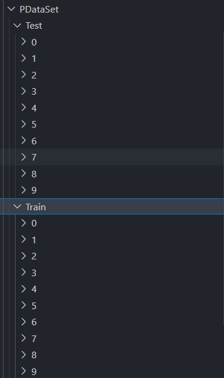

**操作步骤**：

1. 读取到训练集和测试集的所有文件的路径
2. 对每一个图片数据进行分割，图片的名称同样进行分割
3. 以每一个图片名称作为当前数据集的目录，如果该目录不存在，则创建该目录，否则就直接存放该切割后的图片数据，图片数据的名称可以任取。
4. 由于分割的数据图片的大小都不相同，使用`transforms.Resize()`方法将每一个图片的大小都设定为统一的大小。

**切割后的数据如下：**

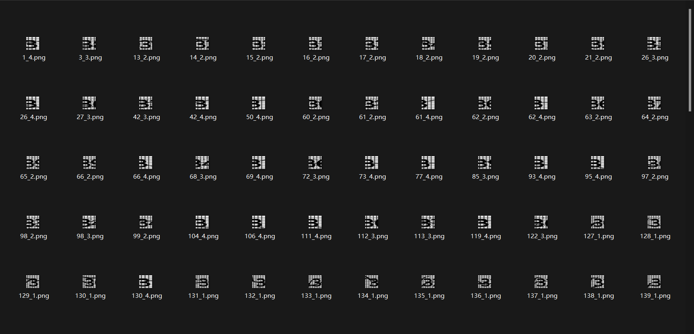

#### 3.4 代码实现

==MarkToSplit.py==

```python
from PIL import Image
from torchvision import transforms
import matplotlib.pyplot as plt
import os
from Modules.utils.FixSplit import fixSp      # 使用绝对导入

transform = transforms.Compose([transforms.ToTensor()])
transformToPil = transforms.ToPILImage()
transformResize = transforms.Resize((32, 32))


#进行显示数据
def showImage(in_tensor):
    img_tensor = in_tensor.permute(1, 2, 0).numpy()
    plt.imshow(img_tensor)
    plt.show()
    plt.close()

# 读取数据
def ReadImage(oDir):
    oFilesName = os.listdir(oDir)
    oFiles = [os.path.join(oDir, f) for f in oFilesName]
    return oFiles


# 分割数据
def SplitImage(imgDir):
    img = Image.open(imgDir)
    imgTensor = transform(img)
    # shape = (3, 50, 135)
    img_ls = fixSp(imgTensor)
    # Resize = (3, 32, 32)
    resizeImg = []
    for img_ in img_ls:
        img_resize = transformResize(img_)
        resizeImg.append(img_resize)
    return img_ls


# 保存数据
def SaveSplitImage(img_tensor, pFile: str):
    # 进行分割路径
    dir, _ = os.path.split(pFile)
    # 检查目标文件是否存在，不存在则创建
    if os.path.exists(dir) == False:
        os.makedirs(dir)

    img = transformToPil(img_tensor)
    img.save(pFile)


# 根据参数对训练集和测试集进行操作
def TrainOrTest(dirFiles, tarFiles):
    for idx, otf in enumerate(dirFiles):
        img_1, img_2, img_3, img_4 = SplitImage(otf)
        _, name = os.path.split(otf)    # 提取文件名称
        _, suffix = os.path.splitext(name)  # 提取文件后缀
        name_1, name_2, name_3, name_4 = name[:4]
        SaveSplitImage(img_1, os.path.join(tarFiles, name_1, f'{idx}_1'+suffix))
        SaveSplitImage(img_2, os.path.join(tarFiles, name_2, f'{idx}_2'+suffix))
        SaveSplitImage(img_3, os.path.join(tarFiles, name_3, f'{idx}_3'+suffix))
        SaveSplitImage(img_4, os.path.join(tarFiles, name_4, f'{idx}_4'+suffix))
def main():
    # 获取训练集与测试集文件路径
    oTrainDir = os.path.join(OROOT_DIR, 'Train')
    oTestDir = os.path.join(OROOT_DIR, 'Test')
    oTrainFiles = ReadImage(oTrainDir)
    oTestFiles = ReadImage(oTestDir)

    # 目标训练集与测试集路径
    pTrainDir = os.path.join(TROOT_DIR, 'Train')
    pTestDir = os.path.join(TROOT_DIR, 'Test')

    if os.path.exists(pTrainDir) == False:
        os.makedirs(pTrainDir)

    if os.path.exists(pTestDir) == False:
        os.makedirs(pTestDir)

    # 首先对训练集进行分割
    TrainOrTest(oTrainFiles, pTrainDir)

    # 对测试集进行分割
    TrainOrTest(oTestFiles, pTestDir)


if __name__ == '__main__':
    OROOT_DIR = 'MDataSet'
    TROOT_DIR = 'PDataSet'
    main()
```

### 4. 模型训练

#### 4.1 编写 DataSet

DataSet 类是为了给模型输送数据，编写 DataSet 类，首先需要知道该类的目的：**DataSet 类的目的是能够通过得到的索引返回出数据和该数据对应的标签**。

DataSet 类中需要实现两个重要的**魔法方法**：

- `__len__`方法：该方法用于得到数据一共有多少个，可以理解为将数据存储为列表，该方法表示返回列表的长度，该方法没有参数。
- `__getitem__`方法：该方法用于通过给定的索引来得到对应的数据以及数据对应的标签，该方法有一个参数`idx`，表示给定的索引。

因此，我们可以将所有数据按照顺序读取到一个列表中，然后其存储的目录为每一个数据对应的标签，将标签也存储到一个列表中，并且要求标签列表中的每一个标签与数据列表中的每一个数据**一一对应**。

#### 4.2 代码实现

==DataSet.py==

```python
import os

import torch
from PIL import Image
from torchvision import transforms
from torch.utils.data import Dataset

class ImageDataset(Dataset):
    def __init__(self, root_dir, transform=None):
        '''
        :param root_dir: 表示训练集路径或测试集路径
        :param image_dir:
        :param transform:
        '''
        self.all_dir = root_dir
        self.label_n = os.listdir(root_dir)     # 所有标签名称
        self.image_dir = [os.path.join(root_dir, nd) for nd in self.label_n]    # 得到所有数字文件的路径
        self.transform = transform
        self.labels, self.images= [], []
        # 得到每一个文件夹下的img
        for idx, fle in enumerate(self.image_dir):
            number_files = [os.path.join(fle, f) for f in os.listdir(fle)]  # 数字目录下的所有文件
            t_labels = [int(self.label_n[idx]) for _ in range(len(number_files))]
            self.images.extend(number_files)
            self.labels.extend(t_labels)


    def __len__(self):
        return len(self.images)

    def __getitem__(self, idx):
        # 得到每一个图片的路径
        img_name = self.images[idx]
        image = Image.open(img_name).convert('RGB')  # 读取图像并转换为RGB格式
        label = self.labels[idx]

        if self.transform:
            image = self.transform(image)
            label = torch.tensor(label)

        return image, label


if __name__ == '__main__':
    ROOTDIR = "DataProce/PDataSet/Train"
    transform = transforms.Compose([transforms.ToTensor()])
    dataset = ImageDataset(ROOTDIR)
    image, label = dataset[-1]
    image.show()
    print(label)
    print(len(dataset))
```

#### 4.3 创建 Model

**模型的结构如下**：

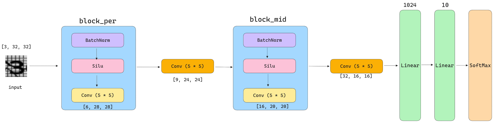

#### 4.4 代码实现

==Model.py==

```python
import torch
from torch import nn


class VerModel(nn.Module):
    def __init__(self, in_channels=3, num_class=10):
        super().__init__()
        self.in_channels = in_channels
        self.num_class = num_class
        self.ln_size = [32, 16, 16]
        # [3, 32, 32] => [6, 28, 28]
        self.block_per = nn.Sequential(
            nn.BatchNorm2d(num_features=3),
            nn.SiLU(),
            nn.Conv2d(in_channels=3, out_channels=6, kernel_size=(5, 5))
        )
        # 使用一个卷积进行下降
        # [6, 28, 28] => [6, 14, 14]
        # self.maxPool = nn.MaxPool2d(kernel_size=(2, 2), stride=2, padding=0)
        # [6, 28, 28] => [9, 24, 24]
        self.convPool_1 = nn.Conv2d(in_channels=6, out_channels=9, kernel_size=(5, 5))
        # [9, 24, 24] => [16, 20, 20]
        self.block_mid = nn.Sequential(
            nn.BatchNorm2d(num_features=9),     # 参数表示通道数
            nn.SiLU(),
            nn.Conv2d(in_channels=9, out_channels=16, kernel_size=(5, 5))
        )
        # [16, 20, 20] => [32, 16, 16]
        self.convPool_2 = nn.Conv2d(in_channels=16, out_channels=32, kernel_size=(5, 5))
        self.linear_1 = nn.Linear(self.ln_size[0] * self.ln_size[1] * self.ln_size[2], 1024)
        self.linear_2 = nn.Linear(1024, self.num_class)
        self.softmax = nn.Softmax(dim=1)

    def forward(self, in_tensor):
        out_tensor = self.block_per(in_tensor)
        out_tensor = self.convPool_1(out_tensor)
        out_tensor = self.block_mid(out_tensor)
        out_tensor = self.convPool_2(out_tensor)
        out_tensor = out_tensor.view(-1, self.ln_size[0] * self.ln_size[1] * self.ln_size[2])
        out_tensor = self.linear_2(self.linear_1(out_tensor))
        return self.softmax(out_tensor)


if __name__ == '__main__':
    in_tensor = torch.randn(3, 3, 32, 32)
    model = VerModel(in_channels=3, num_class=10)
    out_tensor = model(in_tensor)
    print(out_tensor)
```

#### 4.3 Train 训练函数

- 使用`DataLoader`来加载数据，`DataLoader` 有三个重要的参数：

  1. `dataset`：该参数用于放入`DataSet`实例对象，是数据的来源
  2. `batch_size`：该参数用于指定每批次读取数据的大小，通常为：`32, 64, 128, 256, 512`。
  3. `shuffle`：该参数是一个`bool`类型的参数，如果为`True`，表示每次读取数据都会进行随机打乱。

- 损失函数使用**交叉熵损失函数**：`nn.CrossEntropyLoss()`

- 优化器使用`SGD`优化器：`optim.SGD(model.parameters(), lr=0.01, momentum=0.9)`

- 自定义参数：

  1. `epochs`：该参数表示循环迭代的次数。
  2. `device`：该参数表示使用训练的设备，可以是 `cpu` 或 `cuda`。
  3. `batch_size`：该参数用于设定每批次训练的大小，该值越大，训练的速度越快，相应需要的`内存/显存`也就越大。
  4. `save_path`：指定最终训练的权重保存的路径。

  > 自定义参数部分使用`argparse`库进行传参，该库可以在终端中指定参数，这样可以很方便的按照自己的需求进行修改参数。

- 训练模型需要一定的时长，因此可以将终端输出的训练精度、准确率都写进一个列表中，等到程序运行结束之后自动化持久化存储到本地`txt`文件中，以便进行查看训练过程。

**效果如下**：

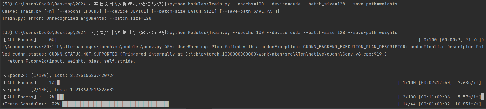

**在终端输入的内容**：

```powershell
python Modules\Train.py --epochs=100 --device=cuda --batch-size=128 --save-path=weights
```

**使用 cuda 训练50次的效果如下**：最后一次的准确率为**98.30%**，基本可以投入使用。

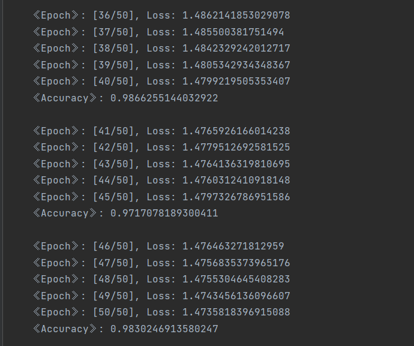

#### 4.4 代码实现

==Train.py==

```python
import os

import torch
from torchvision import transforms
from torch.utils.data import DataLoader
from torch import nn, optim
from DataSet import ImageDataset
from Model import VerModel
from tqdm import tqdm
import argparse


def main(args):
    # 取出数据
    epochs, device, batch_size, save_path = args.epochs, args.device, args.batch_size, args.save_path

    # 定义转换
    transform = transforms.Compose([transforms.ToTensor()])
    # 加载训练集和测试集
    train_dataset = ImageDataset('Modules/DataProce/PDataSet/Train', transform=transform)
    train_dataloader = DataLoader(train_dataset, batch_size=batch_size, shuffle=True)
    test_dataset = ImageDataset('Modules/DataProce/PDataSet/Test', transform=transform)
    test_dataloader = DataLoader(test_dataset, batch_size=batch_size, shuffle=True)

    # 定义模型、损失函数、优化器
    model = VerModel().to(device)
    lossFunction = nn.CrossEntropyLoss()
    optimizer = optim.SGD(model.parameters(), lr=0.01, momentum=0.9)
    TXT = []
    # 进行训练
    for epoch in tqdm(range(epochs), desc="【ALL Epochs】", position=0):
        model.train()
        # 训练
        running_loss = 0.0
        for inputs, labels in tqdm(train_dataloader, desc='<Train Schedule>', position=1, leave=False):
            inputs, labels = inputs.to(device), labels.to(device)
            optimizer.zero_grad()
            outputs = model(inputs)
            loss = lossFunction(outputs, labels.long())
            loss.backward()
            optimizer.step()

            running_loss += loss.item()
        print(f'《Epoch》: [{epoch + 1}/{epochs}], Loss: {running_loss / len(train_dataloader)}')
        TXT.append(f'\t《Epoch》: [{epoch + 1}/{epochs}], Loss: {running_loss / len(train_dataloader)} \n')

        # 测试
        if (epoch + 1) % 5 == 0:     # 设置每间隔5次检验一次效果
            model.eval()
            accuracy = 0.0
            with torch.no_grad():
                for inputs, labels in tqdm(test_dataloader, desc='<Test Schedule>', position=2, leave=False):
                    inputs, labels = inputs.to(device), labels.to(device)
                    outputs = model(inputs)
                    predict = torch.max(outputs, dim=1)[1]
                    acc_nums = torch.eq(predict, labels).sum().item()
                    accuracy += acc_nums
                print("《Accuracy》: ", accuracy / len(test_dataset))
                TXT.append("\t《Accuracy》: {} \n\n".format(accuracy / len(test_dataset)))

    # 进行保存数据
    if os.path.exists(save_path) == False:
        os.mkdir(save_path)
    torch.save(model.state_dict(), os.path.join(save_path, 'VerModel.pth'))
    with open('weights/Record.txt', 'w+', encoding='utf-8') as file:
        file.writelines(TXT)


if __name__ == '__main__':
    # 创建解析器
    parser = argparse.ArgumentParser(description="Greet someone with a message.")
    # --epochs 是一个可选参数（选择性的从命令行传参，具有default）， epochs 是一个位置参数（即：必须由命令行传参，没有default）
    parser.add_argument("--epochs", type=int, default=50, help="循环迭代的次数")
    parser.add_argument("--device", type=str, default='cpu', help="程序运行的设备")
    parser.add_argument("--batch-size", type=int, default=32, help="批次大小")
    parser.add_argument('--save-path', type=str, default='weights', help='权重保存的路径')
    args = parser.parse_args()
    main(args)
```

### 5. 模型验证

#### 5.1 模型验证简介

模型的验证部分用于检验模型是否能够正确的识别出未知的图片数据，首先将图片进行读取，然后使用先前创建的分割函数进行分割，最后将每一个分割后的图片数据输入到模型中得到预测出来的数据。将所有数据进行拼接即得到最终预测出来的数字了。

#### 5.2 代码实现

==Verify.py==

```python
import torch
from Model import VerModel
from torchvision import transforms
from PIL import Image
from utils.FixSplit import fixSp


# 进行识别
def modelVerify(in_tensor, model):
    out_tensor = model(in_tensor)
    return out_tensor

def identify(dir, device='cpu'):
    transformToTensor = transforms.ToTensor()
    transformResize = transforms.Resize((32, 32))
    # 实例化模型
    model = VerModel(in_channels=3, num_class=10).to(device)
    model.load_state_dict(torch.load('weights/VerModel.pth'))
    # 进行分割
    img = Image.open(dir)
    imgTensor = transformToTensor(img)
    img_block_ls = fixSp(imgTensor)
    res = ""
    for img_block in img_block_ls:
        prob = modelVerify(transformResize(img_block).unsqueeze(0), model)
        ans = torch.max(prob, dim=1)[1]
        res += str(ans.item())
    return res


if __name__ == '__main__':
    res = identify('DataProce/MDataSet/Test/3758.png')
    print(res)
```

### 6. 投入使用

#### 6.1 投入使用简介

如最后检验出模型的效果是不错的，能够满足使用，则可以将模型接入需要的使用的程序中，按照具体项目的需求来使用该模型。

#### 6.2 一个简单的案例：预测一个目录中的所有验证码数据

==Experiment.py==

```python
import os
import torch
from Modules.Model import VerModel
from torchvision import transforms
from PIL import Image
from Modules.utils.FixSplit import fixSp


# 进行识别
def modelVerify(in_tensor, model):
    out_tensor = model(in_tensor)
    return out_tensor


def identify(dir, device='cpu'):
    transformToTensor = transforms.ToTensor()
    transformResize = transforms.Resize((32, 32))
    # 实例化模型
    model = VerModel(in_channels=3, num_class=10).to(device)
    model.load_state_dict(torch.load('Modules/weights/VerModel.pth'))
    # 进行分割
    img = Image.open(dir)
    imgTensor = transformToTensor(img)
    img_block_ls = fixSp(imgTensor)
    res = ""
    for img_block in img_block_ls:
        prob = modelVerify(transformResize(img_block).unsqueeze(0), model)
        ans = torch.max(prob, dim=1)[1]
        res += str(ans.item())
    return res


def main(imgDir):
    res = identify(imgDir)
    return res


if __name__ == '__main__':
    expDir = r'./ExperimentalData'
    filesName = os.listdir(expDir)
    # 进行拼接
    filesPaths = [os.path.join(expDir, name) for name in filesName]
    # 对每一个图片分别进行预测
    for path in filesPaths:
        res = main(path)
        print(res)
```

**目录中的所有文件**

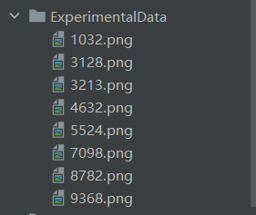

**预测的结果**

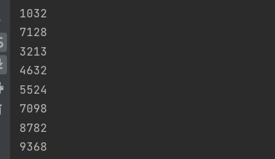
